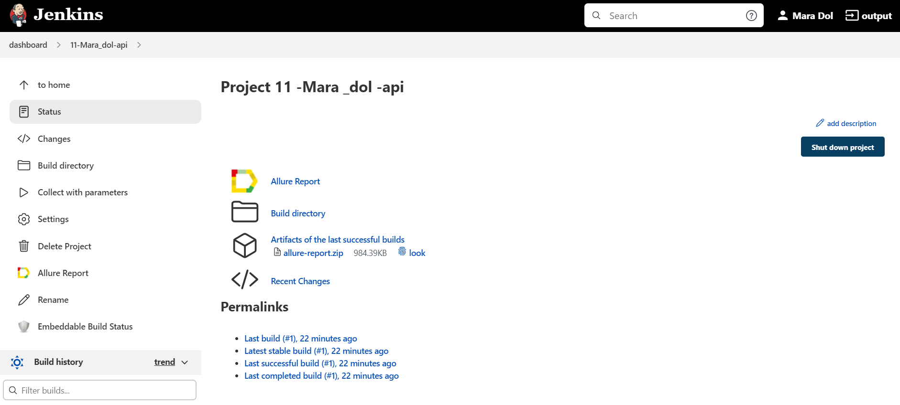
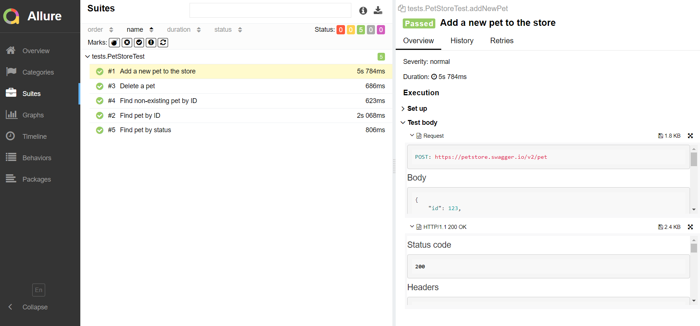
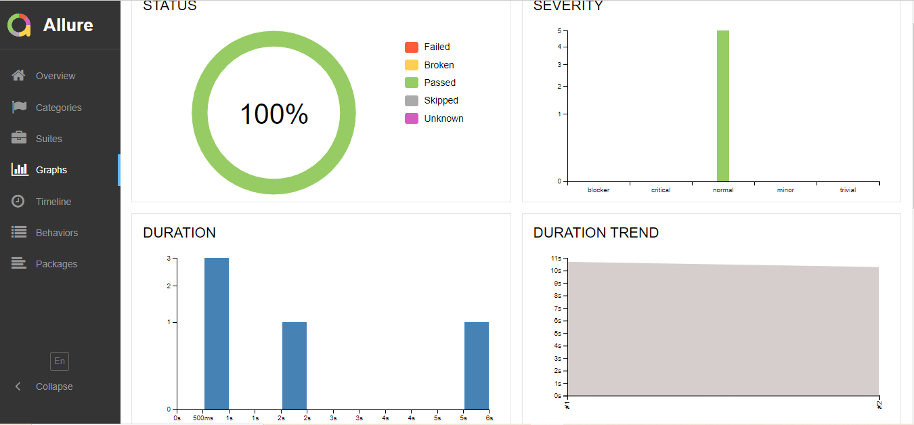

#  API Testing for 'Petstore' website

Click [here](https://petstore.swagger.io/) to take a look at the website!


## Technologies used in the project:

[](https://www.java.com/)
[](https://www.jetbrains.com/idea/)
[](https://github.com/)
[](https://junit.org/junit5/)
[](https://gradle.org/)
[](https://rest-assured.io/)
[](https://github.com/allure-framework/allure2)
[](https://www.jenkins.io/)
[](https://qameta.io/)


## What is special about this project:

✓ RestAssured library

✓ Specifications

✓ Lombok models

✓ Request log custom templates


## To run tests locally use:

```
gradle clean test 
```


## Test cases

✓ Add a new pet to the store

✓ Find pet by ID

✓ Find pet by status

✓ Delete a pet

✓ Find non-existing pet by ID


## Jenkins Job

Jenkins is an automation server which lets us run tests

Click <a target="_blank" href="https://jenkins.autotests.cloud/job/11-Mara_dol-api/">here</a> to see the job for "Petstore"

<p align="center">

</p>

## Allure report

Allure Report is a flexible, lightweight test reporting tool. It provides clear graphical reports and allows extracting 
the maximum of information from the everyday testing process.

Click <a target="_blank" href="https://jenkins.autotests.cloud/job/11-Mara_dol-api/2/allure/">here</a> to see the report for "Petstore"


### There are test suites

<p align="center">

</p>


### There are graphs

<p align="center">

</p>


## Telegram Notification

After the tests are completed, the report comes to Telegram using a bot

